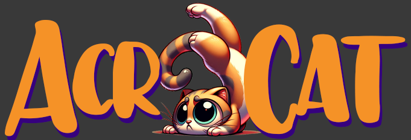

## Overview

AcroCat is a Discord bot cog written for Red, a modular bot framework. It's a fun, interactive game where players create acronyms from randomly generated letters. The game consists of two phases: acronym submission and voting. Players submit their acronyms based on the given letters, and then vote on their favorite. The cog includes customizable settings for game management.

## Commands

### 1. `acrocat`

-   **Description**: Initiates an AcroCat game session with randomly chosen letters or letters chosen from a weighted dict (if weighted letters enabled). Alternatively, the game initator can define the game acronym by supplying it with the acrocat command. i.e [p]acrocat A C R O. 
-   **Usage**: `[p]acrocat` ,  `[p]acrocat A B C D`
-   **Permissions**: None required.

### 2. `acrocatset`

-   **Description**: Group command for AcroCat settings. Displays the current configuration and help menu. 
-   **Usage**: `[p]acrocatset <subcommand>`
-   **Permissions**: `manage_guild`

#### Subcommands:

-   `letters`: Sets the minimum and maximum length of acronyms.
    -   **Usage**: `[p]acrocatset letters <min_length> <max_length>`
    -   **Permissions**: `manage_guild`, Bot owner only.
-   `timing`: Sets the duration for the voting phase.
    -   **Usage**: `[p]acrocatset voting_timeout <timeout>`
    -   **Permissions**: `manage_guild`, Bot owner only.
-   `anon`: Toggles the anonymity of submissions.
    -   **Usage**: `[p]acrocatset anon`
    -   **Permissions**: `manage_guild`, Bot owner only.
-   `weightedletters`: Selected letters for the game acronym will be weighted toward more common letters, preventing too many instances of X,Y,Z.
    - **Usage**: `[p]acrocatset weightedletters 
-   `rewards`: Toggle credits rewards for winning the game. This is integrated with Red Economy. 
    - **Usage**: `[p]acrocatset rewards
-   `rewardrange`: Set the range of the game reward
    - **Usage**: [p]acrocatset <min> <max> 

### 3. `acrocatstat`

-   **Description**: Displays the user's AcroCat game statistics.
-   **Usage**: `[p]acrocatstat`
-   **Permissions**: None required.

#### Subcommands:
- `leaderboard`: Displays a server leaderboard ordered by Acrocat game wins. 

## Listeners

### `on_message`

-   **Description**: Listens for player messages during the game. Handles acronym submissions and voting responses.

## Features

1.  **Acronym Generation**: Generates a random acronym based on configurable length limits.
2.  **Game Phases**: Manages different phases of the game - collecting acronyms and voting.
3.  **Voting System**: Allows players to vote on their favorite acronym.
4.  **Anonymity Option**: Can be set to make submissions anonymous.
5.  **Statistics Tracking**: Tracks each player's submissions, wins, and most voted acronyms.
6.  **Customizable Settings**: Guild administrators can customize game settings.

## Configuration

-   **Guild Settings**: Includes minimum and maximum acronym lengths.
-   **User Settings**: Tracks the number of acronyms submitted, wins, and the most voted acronym for each user.

## Technical Details

-   **Language**: Python
-   **Dependencies**: `discord.py`, `redbot.core`
-   **Asynchronous Programming**: Utilizes `asyncio` for handling asynchronous tasks like countdowns.

## Installation

To install AcroCat, you must have a Red Discord bot instance set up. Once Red is running, you can add this cog by using Red's cog installation commands.

## Notes

-   Ensure the bot has necessary permissions, especially for message management (deleting messages during voting).
-   The game's flow and user experience can be significantly affected by the configured settings, so adjust them according to your server's preferences.
